The Hanoi Omega-Automata Format
===============================

This document describes the Hanoi Omega-Automata (HOA) format.  The name is a reference to the ATVA'13 conference, which was organized in Hanoi, and where the foundations of this format were laid.

The [HTML](http://adl.github.io/hoaf/) and [PDF](http://adl.github.io/hoaf/hoaf.pdf) versions of this document are updated from [the sources on github](https://github.com/adl/hoaf/).

Current tool support is described on a [separate page](http://adl.github.io/hoaf/support.html).

All the examples shown here can also be [downloaded separately](http://adl.github.io/hoaf/examples.html).

Current status
--------------

This is version 1 of the format.  The document may evolve slightly to clarify some parts and fix typos, but you should expect no major semantic change.

If you see any problem, please [report it on the issue tracker](https://github.com/adl/hoaf/issues?state=open).

Change log:
- 2015-02-24: Clarify that `HEADERNAME` may not start with `-`.
- 2015-02-06: Version 1 published.

Goals
-----

Design a format, inspired from [`ltl2dstar`'s format](http://www.ltl2dstar.de/docs/ltl2dstar.html#output-format-dstar), but which:

- is more compact when a lot of atomic propositions are used, or when the automaton is not complete.
- supports non-deterministic and alternating omega-automata.
- supports state-labeled omega-automata.
- supports different types of acceptance conditions, preferably in a way that is easy to extend.
- supports transition-based acceptance.
- consider new lines as any other white-space characters, i.e., as token separators.  All the examples below should work even after newlines have been removed or moved around (this typically happens if you copy/paste an automaton into a mailer that reformats paragraphs).  A use case for not using any newline is when compiling results from experiments into a file, with one automaton per line (and maybe other measurments if that is a CSV file), for easier filtering with line-oriented tools such as grep/cut/sed.
- supports streams of omega-automata (i.e., multiple automata can be concatenated together and processed in batch).

Supported Types of Omega-Automata
---------------------------------

The HOA format supports many types of finite automata over infinite words: automata with labels on transitions or labels on states, and with a wide range of acceptance conditions based on states or transitions appearing (in)finitely often in an automaton run.  Instead of providing semantics for each supported type of omega-automata, we provide only semantics for the general case of alternating automata with labels on transitions and transition-based accepting conditions. Labels on states and state-based acceptance are formally seen as syntactic sugar (their semantics fully corresponding to the expected one).  Automata in HOA format can have multiple initial states.

Preliminary Notes
-----------------

$\def\AP{\mathit{AP}}\def\B{\mathbb{B}}\def\Fin{\mathsf{Fin}}\def\Inf{\mathsf{Inf}}$Input alphabets of all considered automata types consist of letters that are subsets of atomic propositions ($\AP$).  To make the automata description more concise, we label states or transitions of automata with Boolean formulas over $\AP$ representing choices between multiple letters.  A Boolean formula represents the set of letters satisfying the formula: a letter satisfies a formula if the valuation assigning True to all atomic propositions in the letter and False to all other atomic propositions is a model of the formula.  We use $\B(\AP)$ to denote the set of Boolean formulas over $\AP$.

The format considers acceptance conditions built on a finite set $\{S_0,S_1,\ldots,S_k\}$ of acceptance sets.  Each acceptance set $S_i$ is a subset of automata states and transitions.  Loosely speaking, an acceptance condition says which acceptance sets should be visited infinitely often and which only finitely often by a run to be accepting.  More precisely, an acceptance condition is a positive Boolean formula over atoms of the form $\Fin(S_i)$, $\Fin(\lnot S_i)$, $\Inf(S_i)$, or $\Inf(\lnot S_i)$.  The atom $\Fin(S_i)$ indicates that all states and transitions in $S_i$ should occur at most finitely often in the run, while $\Inf(S_i)$ denotes that some state or transition of $S_i$ should be visited infinitely often.  A state in an acceptance set is formally seen as an abbreviation for inclusion of all transitions leaving the state.  The negation symbol $\lnot$ represents the complement of the set with respect to all transitions.  Many examples of classical acceptance conditions (Büchi, Rabin, Streett, parity) will be given later.

The format has a common approach to atomic propositions, states, and acceptance sets: the number of propositions/states/sets, say $n$, is first declared and all propositions/states/sets are then referenced as $0,1,\ldots,n-1$.

Common Tokens
-------------

- `STRING`: a C-like double-quoted string `"(\\.|[^\\"])*"`

- `INT`: `0|[1-9][0-9]*`
  A non-negative integer less than $2^{31}$ written in base 10 (with no useless `0` at the beginning).

- comments: `/* … */`
  Comments may be introduced between any token by enclosing them with `/*` and `*/` (with proper nesting, i.e.  `/*a/*b*/c*/`  is one comment).  C++-style comments are not considered because they require newlines.  Tools can use comments to output additional information (e.g. debugging data) that should be discarded upon reading.

- whitespace: `[ \t\n\r]`
  Except in double-quoted strings and comments, whitespace is used only for tokenization and can be discarded afterwards.

- `BOOLEAN`: `[tf]`
  The true and false Boolean constants.

- `IDENTIFIER`: `[a-zA-Z_][0-9a-zA-Z_-]*`
  An identifier made of letters, digits, `-` and `_`.  Digits and `-` may not by used as first character, and `t` or `f` are not valid identifiers.

- `ANAME`: `@[0-9a-zA-Z_-]+`
  An alias name, i.e., "@" followed by some alphanumeric characters, `-` or `_`.  These are used to identify atomic propositions or subformulas.

- `HEADERNAME`: `[a-zA-Z_][0-9a-zA-Z_-]*:`
  Header names are similar to identifiers, except that they are immediately followed by a colon (i.e. no comment or space allowed).  If an `IDENTIFIER` or a `BOOLEAN` is immediately followed by a colon, it should be considered as a `HEADERNAME`.

General Layout
--------------

This format is designed so that we can write tools that can process automata in batch.  A tool could for instance get a stream of automata descriptions concatenated together as input and process these to output another stream of automata.

Every automaton is described in two parts: a header, that supplies meta-data about the automaton (such as number of states and acceptance condition), and a body, encoding the automaton as a labeled graph.
The two parts are separated by `--BODY--`.  The token `--END--` marks the end of the automaton.

    automaton ::= header "--BODY--" body "--END--"

Additionally, the `--ABORT--` token may be used after any token of this grammar (even in the header) to indicate that the produced automaton should be discarded, for instance in case an error condition is detected during output.  In a streaming scenario, a new automaton can start immediately after such an `--ABORT--` token.  Note that `foo--ABORT--` is a valid identifier and shall not abort streaming: to ensure proper tokenization always add a space or newline before `--ABORT--` to abort the output.

Header
------

    header ::= format-version header-item*
    format-version ::= "HOA:" IDENTIFIER
    header-item ::= "States:" INT
                 | "Start:" state-conj
                 | "AP:" INT STRING*
                 | "Alias:" ANAME label-expr
                 | "Acceptance:" INT acceptance-cond
                 | "acc-name:" IDENTIFIER (BOOLEAN|INT|IDENTIFIER)*
                 | "tool:" STRING STRING?
                 | "name:" STRING
                 | "properties:" IDENTIFIER*
                 | HEADERNAME (BOOLEAN|INT|STRING|IDENTIFIER)*

The header is a list of `header-item`s (a `HEADERNAME` followed by some data).  Except for the "HOA:" item, which should always come first, the items may occur in any order.  Some `HEADERNAME`s have predefined semantics (and might be mandatory) as specified below.   This format also makes provision of additional (unspecified) header names to be used.

Any given `HEADERNAME` should occur at most once, except for `Start:`, `Alias:`, and `properties:`.  The case of the `HEADERNAME`'s initial is used to specify whether tools may safely ignore a header item they do not support: header items whose name start with an upper-case letter are expected to influence the semantic of the automaton: tools should at least warn about any such `HEADERNAME` they do not understand.  A `HEADERNAME` whose initial is lowercase may be safely ignored without affecting the semantics.

Headers items `HOA:`, and `Acceptance:` must always be present.

### `HOA:`

`HOA:` should always be the first token of the file.  It is followed by an identifier that represents the version of the format.  This document specifies the first version of this format so this header should appear as

    HOA: v1

### `States:`

This optionnal header item specifies the number of states in the automaton.

The states are assumed to be numbered consecutively from 0.   For instance:

    States: 10

specifies an automaton with 10 states numbered from 0 to 9.

An empty automaton, with no states, can be specified with `States: 0`.

It is recommended to specify the number of states whenever possible, so that readers may preallocate data structures and perform better error checking.  Cases where `States:` could be missing are typically those where an automaton is constructed on-the-fly during its output, and the actual number of states is unknown before the end of the output.

### `Start:`

This optional header item specifies the initial states.    Multiple initial states can be specified by using several `Start:` headers with a different state number.

Alternating automata can start in a conjunction of states specified using the `&` operator.

    header-item ::= … | "Start:" state-conj
    state-conj ::= INT | state-conj "&" INT

If the `Start:` header item is omitted, then the automaton has no initial state and denotes an empty language.

### `AP:`

`AP:` gives the number of atomic propositions, followed by unique names for each of these atomic propositions (using double-quoted C-strings).  Atomic propositions are implicitly numbered from left to right, starting at 0.

For instance

    AP: 3 "a" "proc@state" "a[x] >= 2"

specifies three atomic propositions:

- atomic proposition 0 is `"a"`
- atomic proposition 1 is `"proc@state"`
- atomic proposition 2 is `"a[x] >= 2"`

The number of double-quoted strings must match exactly the number given, and should all be different.  This number may be 0, in which case it is not followed by any string, and this is equivalent to not using `AP:`.

### `Alias:`

Aliases are used to name atomic propositions or common subformulas that will be used later as labels in the automaton.  This format can be used without any aliases, refering to atomic propositions by their numbers.  Naming atomic propositions using aliases can make the automaton more readable to the human, and naming subformulas that are used repeatedly can help making the output more concise.

    headeritem ::= … | "Alias:" ANAME label-expr
    label-expr ::= BOOLEAN | INT | ANAME | "!" label-expr
                 | "(" label-expr ")"
                 | label-expr "&" label-expr
                 | label-expr "|" label-expr

The `label-expr` will also be used to label transitions in automata.  `INT` refers to an atomic proposition number (as specified on the `AP:` line), `ANAME` refers to a previously defined alias, and `BOOLEAN` are the Boolean values (`t` or `f`).  The `Alias:` line may appear multiple times, but it is forbidden to redefine an alias.  The `!` operator has priority over `&` which in turn has priority over `|`.  Parentheses may be used for grouping.

Here are some examples of aliases:

    AP: 3 "a" "proc@state" "a[x] >= 2"
    Alias: @a 0
    Alias: @ps 1
    Alias: @a2 2
    Alias: @c @ps|@a2

The first three aliases are just mnemonic names for the atomic propositions, while the last one replace some arbitrary subformula.  Defining `@c` before the definition of `@ps` and `@a2` would be incorrect.

### `Acceptance:`

    header-item ::= … | "Acceptance:" INT acceptance-cond

    acceptance-cond ::= IDENTIFIER "(" "!"? INT ")"
                     | "(" acceptance-cond ")"
                     | acceptance-cond "&" acceptance-cond
                     | acceptance-cond "|" acceptance-cond
                     | BOOLEAN

The mandatory `Acceptance:` header item is used to specify the number of acceptance sets used by the automaton and how these acceptance sets are combined in the acceptance condition.  If $m$ sets are declared, these sets are numbered from $0$ to $m-1$.   In this version of the format, the `IDENTIFIER` used in `acceptance-cond` can only be `Fin` or `Inf`.

The acceptance condition is specified as a positive Boolean combination of expressions of the form `Fin(x)`, `Fin(!x)`, `Inf(x)`, and `Inf(!x)` where:

- `x` is an integer in $[0,m)$ representing an accepting set,
- `!x` represents the complement of that set,
- `Fin(x)` and `Inf(x)` specify whether that set should be visited finitely or infinitely often.

The `&` operator has priority over `|`, and parentheses may be used for grouping.

Additionally the `t` and `f` Boolean constants can be used with their obvious meanings (`t` is always accepting while  `f` is never accepting).

As explained previously, our semantics for acceptance are transition-based, so if an automaton uses both accepting states and accepting transitions, the acceptance of the states should be transferred to their outgoing transitions so that complementation of acceptance sets can be performed with respect to all transitions.

For instance

    Acceptance: 2 Fin(!0) & Inf(1)

declares two acceptance sets.  A run of the automaton is accepting if it visits the complement of the first set finitely often, and if it visits the second set infinitely often.  More examples will be given in a later section.

An acceptance condition declaring $m$ sets needs not actually use all of these sets.  In this case the unused sets can be ignored if they appear in the body of the automaton.

### `acc-name:`

    header-item ::= … | "acc-name:" IDENTIFIER (IDENTIFIER | INT)*

This optional header item gives a symbolic name to the acceptance conditions specified by the mandatory `Acceptance:` header item.

The first `IDENTIFIER` is a name, and the remaining `IDENTIFIER`s and `INT`s are parameters.  The following acceptance names are fully specified in a later section:

- `Buchi`
- `generalized-Buchi`
- `co-Buchi`
- `generalized-co-Buchi`
- `Streett`
- `Rabin`
- `generalized-Rabin`
- `parity`
- `all`
- `none`

Additional (unspecified) acceptance names may be used when needed.

### `tool:` and `name:`

    header-item ::= …
                 | "tool:" STRING STRING?
                 | "name:" STRING

These optional header items can be used to record information about the tool used to produce the automaton, or to give a name to this automaton.  The two arguments of `tool:` corresponds respectively to the tool's name and its (optional) version number.

For instance:

    tool: "ltl-translate" "1.2-alpha"
    name: "BA for GFa & GFb"

### `properties:`

    header-item ::= … | "properties:" IDENTIFIER*

The optional `properties:` header name can be followed by a list of identifiers that gives additional information about the automaton.  Multiple `properties:` lines can be used, it has the same effect as listing all properties on one line.  This information should be redundant in the sense that ignoring them should not impact the behavior of the automaton.  For instance stating that an automaton is deterministic with

    properties: deterministic

may enable tools that read the automaton to choose a better data structure to store this automaton, but ignoring this header item will not suddenly make the automaton non-deterministic.

The following properties have specified meanings, but additional may be added, and tools may simply ignore those they do not know:

- `state-labels` hints that the automaton uses only state labels
- `trans-labels` hints that the automaton uses only transition labels
- `implicit-labels` hints that the automaton uses only implicit transitions labels
- `explicit-labels` hints that the automaton uses only explicit transitions labels
- `state-acc` hints that the automaton uses only state-based acceptance specifications
- `trans-acc` hints that the automaton uses only transition-based acceptance specifications
- `univ-branch` hints that the automaton uses universal branching for at least one transition or for the initial state
- `no-univ-branch` hints that the automaton does not uses universal branching
- `deterministic` hints that the automaton is deterministic, i.e., it has at most one initial state, and the outgoing transitions of each state have disjoint labels (note that this also applies in the presence of universal branching)
- `complete` hints that the automaton is complete, i.e., it has at least one state, and the transition function is total
- `unambiguous` hints that the automaton is unambiguous, i.e., for each word there is at most one accepting run of the automaton (this also applies in the presence of universal branching)
- `stutter-invariant` hints that the automaton describes a [stutter-invariant](http://dx.doi.org/10.1007/3-540-48683-6_22) property
- `weak` hints that in each strongly connected component (in alternating automata, SCC can be defined in standard way if we see each universal branching transition as a set of non-branching transitions), all transitions (or all states) belong to the same accepting sets
- `very-weak` hints that the automaton is weak and every SCC has exactly one state
- `inherently-weak` hints that the automaton does not mix accepting cycles and non-accepting cycles in the same SCC
- `terminal` hints that the automaton is weak, that no non-accepting cycle can be reached from any accepting cycle, and that each SCC containing an accepting cycle is complete, i.e., the transition function is definied for each state of the SCC and each letter
- `tight` hints that the automaton is [tight](http://dx.doi.org/10.1007/978-3-540-31980-1_32), i.e. for every word $w=a_0a_1\ldots$ accepted by the automaton there exists an accepting run over $w$ such that whenever two suffixes $w_i=a_ia_{i+1}\ldots$ and $w_j=a_ja_{j+1}\ldots$ of $w$ are identical, the run reaches identical states (or sets of the states in the case of alternating automaton) by reading the corresponding prefixes $a_0\ldots a_{i-1}$ and $a_0\ldots a_{j-1}$

Note that even if some property implies another one (for instance `explicit-labels` implies `trans-labels`) it is recommended to specify both.

Acceptance Specifications
-------------------------

Even if `acc-name:` is used, the `Acceptance:` line is mandatory and should match exactly the patterns given in the following examples.  This way the tools that ignore the `acc-name:` line have no suprise.  In fact, the `Acceptance:` line is what defines the acceptance semantics of the automaton and the `acc-name:` has only informative value.   Some of the examples below use `Acceptance:` specifications for which there are no `acc-name:` defined.

### Büchi or co-Büchi

Simply:

    acc-name: Buchi
    Acceptance: 1 Inf(0)

or

    acc-name: co-Buchi
    Acceptance: 1 Fin(0)

### Generalized Büchi or generalized co-Büchi

A generalized automaton with three acceptance sets can be defined with:

    acc-name: generalized-Buchi 3
    Acceptance: 3 Inf(0)&Inf(1)&Inf(2)

A deterministic automaton with such acceptance conditions could be complemented without changing its transition structure by simply complementing the acceptance, giving a generalized co-Büchi automaton:

    acc-name: generalized-co-Buchi 3
    Acceptance: 3 Fin(0)|Fin(1)|Fin(2)

A promise automaton generated by the tableau construction of [`ltl2tgba`](http://spot.lip6.fr/userdoc/ltl2tgba.html) could be output with:

    Acceptance: 3 Inf(!0) & Inf(!1) & Inf(!2)

(Spot actually makes an extra pass at the end of the translation to complement the acceptance sets in order to obtain the more usual generalized Büchi `Inf(0)&Inf(1)&Inf(2)` acceptance).

### Streett acceptance

Pairs of acceptance sets $\{(L_1,U_1),\ldots,(L_k,U_k)\}$.  A run is accepting for a pair $(L_i,U_i)$ iff the run visiting $L_i$ infinitely often implies that the run also visits $U_i$ infinitely often. A run is accepting iff it is accepting for all pairs. Assuming $k=3$ and numbering these 6 sets from left ($L_1$) to right ($U_3$), this corresponds to:

    acc-name: Streett 3
    Acceptance: 6 (Fin(0)|Inf(1))&(Fin(2)|Inf(3))&(Fin(4)|Inf(5))

The parameter `3` in `acc-name: Streett 3` refers to the number of Streett pairs.

Note that an acceptance set may be used more than once.  For instance when translating `(GF(a) -> GF(b)) & (GF(b) -> GF(c))` into a Streett automaton, it would make sense to use:

    Acceptance: 3 (Fin(0)|Inf(1))&(Fin(1)|Inf(2))

### Rabin acceptance

There are several equivalent presentations of Rabin acceptance, and working with tools that use different definitions is often a source of confusion.  Our notations of the acceptance condition accommodate all styles, while giving clear and unambiguous semantics.

J. Klein, in [`ltl2dstar`](http://www.ltl2dstar.de/docs/ltl2dstar.html#dra_dsa), uses pairs $\{(L_1,U_1),\ldots,(L_k,U_k)\}$ where there should be some pair $(L_i,U_i)$ such that states in $L_i$ are visited infinitely often, but states in $U_i$ are visited finitely often.  This is simply the complement of the Streett acceptance above:

    Acceptance: 6 (Inf(0)&Fin(1))|(Inf(2)&Fin(3))|(Inf(4)&Fin(5))

C. Löding, in [his diploma thesis](http://automata.rwth-aachen.de/~loeding/diploma_loeding.pdf), uses pairs $\{(E_1,F_1),\ldots,(E_k,F_k)\}$ where $E_i$ should be visited finitely often, and $F_i$ should be visited infinitely often.  This is just a reordering of the previous pairs:

    acc-name: Rabin 3
    Acceptance: 6 (Fin(0)&Inf(1))|(Fin(2)&Inf(3))|(Fin(4)&Inf(5))

The parameter `3` in `acc-name: Rabin 3` refers to the number of Rabin pairs.
The reason this definition was choosen for `acc-name: Rabin` is that is seems to be the most commonly used.

S. Krishnan, in [his ISAAC'94 paper](http://dx.doi.org/10.1007/3-540-58325-4_202), uses pairs $\{(L_1,U_1),\ldots,(L_k,U_k)\}$ such that the set of recurring states of a an accepting run should intersect $L_i$ and be included in $U_i$, for some pair $(L_i,U_i)$.  A similar definition is used by Manna and Pnueli in their "Hierarchy of Temporal Properties" paper.  This corresponds to:

    Acceptance: 6 (Inf(0)&Fin(!1))|(Inf(2)&Fin(!3))|(Inf(4)&Fin(!5))

### Generalized Rabin acceptance

Rabin acceptance has been generalized in works by [Křetínský & Esparza](http://arxiv.org/abs/1204.5057) or [Babiak et al.](http://dx.doi.org/10.1007/978-3-319-02444-8_4).  They both translate LTL formulas into generalized Rabin automata in which the acceptance condition may look like $\{(E_1,\{F_{11},F_{12},F_{13}\}), (E_2,\{F_{21},F_{22}\})\}$, and where a run is accepting if there exists some i such that the run visits finitely often the set $E_i$ and infinitely often all the sets $F_{ij}$.  Such an acceptance condition can be specified with:

    acc-name: generalized-Rabin 2 3 2
    Acceptance: 7 (Fin(0)&Inf(1)&Inf(2)&Inf(3))|(Fin(4)&Inf(5)&Inf(6))

The first parameter of `generalized-Rabin` gives the number of generalized pairs and the following parameters give the number of $F_{ij}$ sets in the corresponding pairs.

### Parity automata

For parity automata `acc-name: parity` has three parameters to support combinations of `min`/`max` and `even`/`odd`, and to specify the range of acceptance sets used.

If the automaton should accept when the least identifier of acceptance sets visited infinitely often is even, we write:

    acc-name: parity min even 5
    Acceptance: 5 Inf(0) | (Fin(0)&Fin(1)&Inf(2)) |
                  (Fin(0)&Fin(1)&Fin(2)&Fin(3)&Inf(4))

or

    Acceptance: 5 Inf(0) | Fin(0)&Fin(1)&(Inf(2) | Fin(2)&Fin(3)&Inf(4))

If the greatest identifier has to be odd, we write:

    acc-name: parity max odd 6
    Acceptance: 6 Inf(5) | (Fin(5)&Fin(4)&Inf(3)) |
                  (Fin(5)&Fin(4)&Fin(3)&Fin(2)&Inf(1))

Combinations `min odd` or `max even` are also possible.

### Trivial acceptance conditions: `all` and `none`

When `generalized-Büchi` or `Streett` are used with `0` acceptance sets, it degenerates to an automaton that accepts all recognized words:

    acc-name: generalized-Buchi 0
    Acceptance: 0 t

or

    acc-name: Streett 0
    Acceptance: 0 t

Such an all-accepting condition typically occurs when translating safety formula, or when building monitors.  In these specialized cases, it might not really make sense to name the acceptance `generalized-Buchi` or `generalized-Streett`.  For this reason, we also support the name `all` as a synonym:

    acc-name: all
    Acceptance: 0 t

Similarly, but less interestingly, `generalized-co-Buchi` and `Rabin` all degenerate to `f` when using 0 acceptance pairs, and this acceptance condition can also be called `none`.  The following four acceptance specification are therefore equivalent and describe automata that will reject all words:

    acc-name: generalized-co-Buchi 0
    Acceptance: 0 f

    acc-name: Rabin 0
    Acceptance: 0 f

    acc-name: generalized-Rabin 0
    Acceptance: 0 f

    acc-name: none
    Acceptance: 0 f

Body of the Automaton
---------------------

The header is separated from the rest of the structure with `--BODY--`.

States should be numbered from $0$ to $n-1$ (where $n$ is the value given by the `States:` header item if present) and specified with the following grammar:

    body             ::= (state-name edge*)*
    // the optional dstring can be used to name the state for
    // cosmetic or debugging purposes, as in ltl2dstar's format
    state-name       ::= "State:" label? INT STRING? acc-sig?
    acc-sig          ::= "{" INT* "}"
    edge             ::= label? state-conj acc-sig?
    label            ::= "[" label-expr "]"

The `INT` occurring in the `state-name` rule is the number of this state.  States should be numbered from $0$ to $n-1$, may be listed in any order, but should all be listed (i.e., if the header has `States: 10` then the body should have ten `State: INT` statements, with all numbers from 0 to 9).   In addition to a number, a state may optionally be given a name (the `STRING` token) for cosmetic or practical purposes.

The `INT*` used in `acc-sig` represent the acceptance sets the state or edge belongs to.  Since we use transition-based acceptance, when `acc-sig` is used on a state to declare membership to some acceptance sets, it is syntactic sugar for the membership of all the outgoing transitions to this set.  For instance `State: 0 {1 3}` would states that all transitions leaving state 0 are in acceptance sets 1 and 3.

The `state-conj` encodes the destination of an edge as a conjunction of state numbers.  Non-alternating automata always use a single state number as destination.  These conjunctions makes it possible to encode the universal branching of alternating automata, while disjunction is simply encoded as multiple transitions.

If a state has a `label`, no outgoing edge of this state should have a `label`: this should be used to represent state-labeled automata.  In our semantics, we have to view this as syntactic sugar for all outgoing transitions being labeled by this very same `label`.

If an edge has a `label`, all edges of this state should have a `label`.

If one state has no `label`, and no labeled edges, then there should be exactly $2^a$ edges listed, where $a$ is the number of atomic propositions.  In this case, each edge corresponds to a transition, with the same order as in `ltl2dstar`. If a transition $t$ is the $i$-th transition of a state (starting with 0), then the label of $t$ can be deduced by interpreting $i$ as a bitset. The label is a set of atomic propositions such that the atomic proposition $j$ is in the set if the $j$-th least significant bit of $i$ is set to 1.

Examples
--------

### Transition-based Rabin acceptance and explicit labels

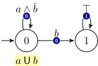

    HOA: v1
    States: 2
    Start: 0
    acc-name: Rabin 1
    Acceptance: 2 (Fin(0) & Inf(1))
    AP: 2 "a" "b"
    --BODY--
    State: 0 "a U b"   /* An example of named state */
      [0 & !1] 0 {0}
      [1] 1 {0}
    State: 1
      [t] 1 {1}
    --END--

### State-based Rabin acceptance and implicit labels

Because of implicit labels, the automaton necessarily has to be deterministic and complete.

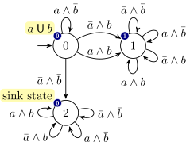

    HOA: v1
    States: 3
    Start: 0
    acc-name: Rabin 1
    Acceptance: 2 (Fin(0) & Inf(1))
    AP: 2 "a" "b"
    --BODY--
    State: 0 "a U b" { 0 }
      2  /* !a  & !b */
      0  /*  a  & !b */
      1  /* !a  &  b */
      1  /*  a  &  b */
    State: 1 { 1 }
      1 1 1 1       /* four transitions on one line */
    State: 2 "sink state" { 0 }
      2 2 2 2
    --END--

### TGBA with implicit labels

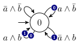

    HOA: v1
    name: "GFa & GFb"
    States: 1
    Start: 0
    acc-name: generalized-Buchi 2
    Acceptance: 2 (Inf(0) & Inf(1))
    AP: 2 "a" "b"
    --BODY--
    State: 0
      0       /* !a  & !b */
      0 {0}   /*  a  & !b */
      0 {1}   /* !a  &  b */
      0 {0 1} /*  a  &  b */
    --END--

### TGBA with explicit labels

    HOA: v1
    name: "GFa & GFb"
    States: 1
    Start: 0
    acc-name: generalized-Buchi 2
    Acceptance: 2 (Inf(0) & Inf(1))
    AP: 2 "a" "b"
    --BODY--
    State: 0
    [!0 & !1] 0
    [0 & !1]  0 {0}
    [!0 & 1]  0 {1}
    [0 & 1]   0 {0 1}
    --END--

### TGBA with explicit labels using aliases

The following demonstrates the use of aliases to make the output slightly more readable (using `@a` instead of `0`), and to abbreviate commonly used subformulas (`@bc` instead of `1 & 2`).

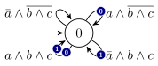

    HOA: v1
    name: "GFa & GF(b & c)"
    States: 1
    Start: 0
    acc-name: generalized-Buchi 2
    Acceptance: 2 (Inf(0) & Inf(1))
    AP: 3 "a" "b" "c"
    Alias: @a 0
    Alias: @bc 1 & 2
    --BODY--
    State: 0
    [!@a & !@bc] 0
    [@a & !@bc]  0 {0}
    [!@a & @bc]  0 {1}
    [@a & @bc]   0 {0 1}
    --END--

### Non-deterministic State-based Büchi automaton (à la Wring)

Encoding `GFa` using state labels requires multiple initial states.

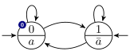

    HOA: v1
    name: "GFa"
    States: 2
    Start: 0
    Start: 1
    acc-name: Buchi
    Acceptance: 1 Inf(0)
    AP: 1 "a"
    --BODY--
    State: [0] 0 {0}
      0 1
    State: [!0] 1
      0 1
    --END--

In this case, the acceptance and labels are carried by the states, so the only information given by the `edges` lists are the destinations states `0 1`.

Note that even if a tool has no support for state labels or multiple initial states, the above automaton could easily be transformed into a transition-based one upon reading.  It suffices to add a new initial state connected to all the original initial states, and then to move all labels onto incoming transitions.  Acceptance sets can be moved to incoming or (more naturally) to outgoing transitions.  For instance the following transition-based Büchi automaton is equivalent to the previous example:

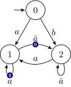

    HOA: v1
    States: 3
    Start: 0
    acc-name: Buchi
    Acceptance: 1 Inf(0)
    AP: 1 "a"
    --BODY--
    State: 0
     [0] 1
     [!0]  2
    State: 1  /* former state 0 */
     [0] 1 {0}
     [!0] 2 {0}
    State: 2  /* former state 1 */
     [0] 1
     [!0] 2
    --END--

### Mixing state-based and transition-based acceptance

Here is a Büchi automaton for `GFa | G(b <-> Xa)`.

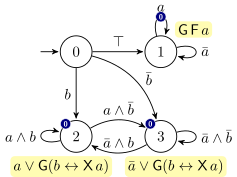

    HOA: v1
    name: "GFa | G(b <-> Xa)"
    Start: 0
    acc-name: Buchi
    Acceptance: 1 Inf(0)
    AP: 2 "a" "b"
    properties: explicit-labels trans-labels
    --BODY--
    State: 0
     [t] 1
     [1] 2
     [!1] 3
    State: 1 "GFa"
     [0] 1 {0}
     [!0] 1
    State: 2 "a & G(b <-> Xa)" {0}
     [0&1] 2
     [0&!1] 3
    State: 3 "!a & G(b <-> Xa)" {0}
     [!0&1] 2
     [!0&!1] 3
    --END--

In this automaton, marking states 2 and 3 as belonging to set 0
is equivalent to marking all their outgoing transitions as such:

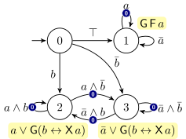

    HOA: v1
    name: "GFa | G(b <-> Xa)"
    Start: 0
    acc-name: Buchi
    Acceptance: 1 Inf(0)
    AP: 2 "a" "b"
    properties: explicit-labels trans-labels trans-acc
    --BODY--
    State: 0
     [t] 1
     [1] 2
     [!1] 3
    State: 1 "GFa"
     [0] 1 {0}
     [!0] 1
    State: 2 "a & G(b <-> Xa)"
     [0&1] 2 {0}
     [0&!1] 3 {0}
    State: 3 "!a & G(b <-> Xa)"
     [!0&1] 2 {0}
     [!0&!1] 3 {0}
    --END--

Mixing state-based and transition-based acceptance can also be done in the same state.  For instance a state like:

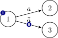

    State: 1 {1}
     [0] 2
     [!0] 3 {0}

is equivalent to

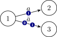

    State: 1
     [0] 2 {1}
     [!0] 3 {0 1}

### Alternating automata

Here is an example of alternating transition-based co-Büchi automaton encoding `(Fa & G(b&Xc)) | c`, it shows an example of multiple initial states (including a conjunct), and an example of conjunct destination.

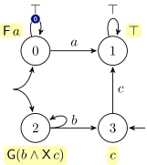

    HOA: v1
    name: "(Fa & G(b&Xc)) | c"
    States: 4
    Start: 0&2
    Start: 3
    acc-name: co-Buchi
    Acceptance: 1 Fin(0)
    AP: 3 "a" "b" "c"
    --BODY--
    State: 0 "Fa"
    [t] 0 {0}
    [0] 1
    State: 1 "true"
    [t] 1
    State: 2 "G(b&Xc)"
    [1] 2&3
    State: 3 "c"
    [2] 1
    --END--

Formal Semantics of Omega-Automata
----------------------------------

The following definition specifies alternating automata with transition-based acceptance.  Because of universal branching, the initial states and destination states of transitions are non-empty sets of states (i.e., elements of $2^Q\setminus\{\emptyset\}$) interpreted as conjunctions.  Automata without universal branching use just elements of Q as initial or destination states.

Each omega-automaton described in this format can be seen as an automaton $\langle\AP,Q,R,I,F,\mathit{Acc}\rangle$ with labels on transitions and transition-based acceptance, where:

- $\AP$ is a finite set of atomic propositions. We use $\B(\AP)$ to denote the set of Boolean formulas over $\AP$.
- $Q$ is a finite set of states.
- $R\subseteq Q\times\B(\AP)\times(2^Q\setminus\{\emptyset\})$ is a transition relation.  A triplet $(s,\ell,D)\in R$ represents a transition from $s$ to the conjunction of states in $D$, labeled by a Boolean formula $\ell\in\B(\AP)$.
- $I\subseteq(2^Q\setminus\{\emptyset\})$ is a set of initial conjunctions of states.
- $F=\{S_0,S_1,\ldots,S_k\}$ is a finite set of acceptance sets.  Each acceptance set $S_i\subseteq R$ is a subset of **transitions**.
- $\mathit{Acc}$ is a Boolean formula over $\{\Fin(S),\Fin(\lnot S),\Inf(S),\Inf(\lnot S)\mid S\in F\}$.

The automaton is interpreted over infinite words, where letters are subsets of AP. A **run** over a word $w=a_0 a_1\ldots$ is an infinite labeled directed acyclic graph $(V,E,\lambda)$ such that:

- $V$ is partitioned into $V_0\cup V_₁\cup V_2\ldots$ where the sets $V_i$ are disjoint,
- for each edge $e\in E$ there exists $i\ge 0$ such that $e\in V_i\times V_{i+1}$,
- $\lambda:V\to Q$ is a labeling function such that $\{\lambda(x)\mid x\in V_0\}\in I$ and for each $x\in V_i$ there exists a transition $(\lambda(x),\ell_i,\{\lambda(y)\mid (x,y)\in E\})\in R$ such that $\ell_i$ evaluates to True in the valuation assigning True to atomic propositions in $a_i$ and False to all other atomic propositions. We say that the transition $(\lambda(x),\ell_i,\{\lambda(y)\mid(x,y)\in E\})$ is **applied to** $x$.

Runs of automata without universal branching are simply infinite linear sequences of nodes.

A run is **accepting** if each branch of the run (i.e., each infinite oriented path starting in $V_0$) satisfies the acceptance condition $\mathit{Acc}$, where a branch satisfies

- $\Fin(S)$ if all transitions in $S$ are applied only to finitely many nodes on the branch.
- $\Fin(\lnot S)$ if all transitions outside $S$ are applied only to finitely many nodes on the branch.
- $\Inf(S)$ if some transition in $S$ is applied to infinitely many nodes on the branch.
- $\Inf(\lnot S)$ if some transition outside $S$ is applied to infinitely many nodes on the branch.

The automaton recognizes the language of all words for which there exists an accepting run of the automaton.

As mentioned above, the format also supports labels on states.  This is formally seen as an abbreviation for the situation where all transitions leaving the state have this label.  The format even admits automata combining states with labels, unlabeled states with labels on all outgoing transitions, and unlabeled states with implicitly labeled transitions.

The format supports both state-based and transition-based acceptance sets.  In our transition-based semantics, as illustrated by our previous examples, marking a state as belonging to some acceptance set with (for instance) `State: 0 {1 3}` is syntactic sugar for marking all the outgoing transitions of state 0 as belonging to acceptance sets 1 and 3.  This is especially important if one combines states and transitions in an acceptance set and use negation of this acceptance sets in the acceptance condition.

Semantics for Pure State-Based Acceptance
-----------------------------------------

In tools that manipulate only state-based acceptance, acceptance will only be used for states, and therefore the transition-based semantics are inconvenient.   For these tools, one can consider the following semantics.

The omega-automata are represented by a tuple $\langle\AP,Q,R,I,F,\mathit{Acc}\rangle$, where:

- $\AP$ is a finite set of atomic propositions.
- $Q$ is a finite set of states.
- $R\subseteq Q\times\B(\AP)\times(2^Q\setminus\{\emptyset\})$ is a transition relation,
- $I\subseteq(2^Q\setminus\{\emptyset\})$ is a set of initial conjunctions of states,
- $F=\{S_0,S_1,\ldots,S_k\}$ is a finite set of acceptance sets.  Each acceptance set $S_i\subseteq Q$ is a subset of **states**.
- $\mathit{Acc}$ is an acceptance condition.

The only difference with the transition-based definition is that $S_i\subseteq Q$ instead of $S_i\subseteq R$.  The acceptance condition is still a formula defined over $\Fin(S_i)$, $\Fin(\lnot S_i)$, $\Inf(S_i)$, or $\Inf(\lnot S_i)$, but this time each $S_i$ is a set of **states** that must occur infinitely or finitely often on each branch of an accepting run, and the complement operation $\lnot$ should be done with respect to $Q$ instead of $R$.

An automaton with state-based acceptance can be trivially converted to transition-based acceptance by shifting the acceptance set membership from each state to its outgoing transitions, and the two semantics are compatible in the sense that the two automata would recognize the same language.  If the automaton has no dead states (i.e., states without successor), the result of such transformation can easily be reversed.

The two semantics disagree slightly on the handling of dead states. The state-based semantics allow dead states to appear in acceptance sets, while there is no way to do that with transition-based acceptance.  This difference is inconsequential: a dead state is never going to contribute anything useful the recognized language.

Authors
-------

This document has been put together by the following people:

- Alexandre Duret-Lutz
- František Blahoudek
- Jan Křetínský
- Jan Strejček
- Joachim Klein
