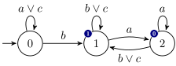
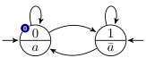

The Hanoi Omega-Automata Format
===============================

This document describes the Hanoi Omega-Automata (HOA) format.  The name is a reference to the ATVA'13 conference, which was organized in Hanoi, and where the foundations of this format were laid.

The [HTML](http://adl.github.io/hoaf/) and [PDF](http://adl.github.io/hoaf/hoaf.pdf) versions of this document are updated from [the sources on github](https://github.com/adl/hoaf/).

Current tool support is described on a [separate page](http://adl.github.io/hoaf/support.html).

All the examples shown here can also be [downloaded separately](http://adl.github.io/hoaf/examples.html).

For a short introduction we have a [**tool paper**](https://www.lrde.epita.fr/~adl/dl/adl/babiak.15.cav.pdf) published at [CAV'15](http://i-cav.org/2015/).  [The **slides**](https://www.lrde.epita.fr/~adl/dl/adl/babiak.15.cav.slides.pdf) from the lightning talk are available, but [the **poster**](https://www.lrde.epita.fr/~adl/dl/adl/babiak.15.cav.poster.pdf) covers much more of the format.

Current status
--------------

This is version 1.1 of the format.  The document may evolve slightly to clarify some parts and fix typos, but you should expect no major semantic change.

If you see any problem, please [report it on the issue tracker](https://github.com/adl/hoaf/issues?state=open).

Change log:
- YYYY-MM-DD: Version 1.1 published, with the following changes:
    - Support for `.` in identifiers, and semantic of version numbers. ([#56](https://github.com/adl/hoaf/issues/56))
    - Support for letter-based alphabets using `Alphabet:`. ([#54](https://github.com/adl/hoaf/issues/54))
    - Support for negated properties. ([#55](https://github.com/adl/hoaf/issues/55))
    - `complete` automata must have at least one *initial* state ([#58](https://github.com/adl/hoaf/issues/57))
- 2015-06-21: Improve definition of accepting sets in the semantics. ([#48](https://github.com/adl/hoaf/issues/48))
- 2015-05-26: Clarify notion of canonical encoding, better support for parity automata with `property: colored`, and cleaner definition of parity acceptance in corner cases. ([#46](https://github.com/adl/hoaf/issues/46))
- 2015-05-20: More compact canonical encoding for parity acceptance, and canonical encoding for `min odd` and `max even`. ([#42](https://github.com/adl/hoaf/issues/42) and [#43](https://github.com/adl/hoaf/issues/43))
- 2015-04-17: Some clarification in case `States:` is missing. ([#39](https://github.com/adl/hoaf/issues/39))
- 2015-04-17: Fix transition-based semantics to deal with duplicate transitions. ([#38](https://github.com/adl/hoaf/issues/38))
- 2015-02-24: Clarify that `HEADERNAME` may not start with `-`. ([#37](https://github.com/adl/hoaf/issues/37))
- 2015-02-06: Version 1 published.

Goals
-----

Design a format, inspired by [`ltl2dstar`'s format](http://www.ltl2dstar.de/docs/ltl2dstar.html#output-format-dstar), but which:

- is more compact when a lot of atomic propositions are used, or when the automaton is not complete.
- supports non-deterministic and alternating omega-automata.
- supports state-labeled omega-automata.
- supports different types of acceptance conditions, preferably in a way that is easy to extend.
- supports transition-based acceptance.
- consider new lines as any other white-space characters, i.e., as token separators.  All the examples below should work even after newlines have been removed or moved around (this typically happens if you copy/paste an automaton into a mailer that reformats paragraphs).  A use case for not using any newline is when compiling results from experiments into a file, with one automaton per line (and maybe other measurments if that is a CSV file), for easier filtering with line-oriented tools such as grep/cut/sed.
- supports streams of omega-automata (i.e., multiple automata can be concatenated together and processed in batch).

Supported Types of Omega-Automata
---------------------------------

The HOA format supports many types of finite automata over infinite words: automata with labels on transitions or labels on states, and with a wide range of acceptance conditions based on states or transitions appearing (in)finitely often in an automaton run.  Instead of providing semantics for each supported type of omega-automata, we provide only semantics for the general case of alternating automata with labels on transitions and transition-based accepting conditions. Labels on states and state-based acceptance are formally seen as syntactic sugar (their semantics fully corresponding to the expected one).  Automata in HOA format can have multiple initial states.

Preliminary Notes
-----------------

### Input alphabet ###

$\def\AP{\mathit{AP}}\def\B{\mathbb{B}}\def\Fin{\mathsf{Fin}}\def\Inf{\mathsf{Inf}}\def\true{\mathsf{true}}\def\false{\mathsf{false}}$The input alphabets $\Sigma$ of all considered automata types consist of a finite set of letters.  The alphabet can be specified in two ways: either directly by providing the set of letters $\Sigma = \{\sigma_1, \ldots, \sigma_n\}$, or via a set of atomic propositions $\AP = \{p_1, \ldots, p_n\}$, where the letters of the alphabet are subsets of $\AP$, i.e., $\Sigma = 2^\AP$.  Alphabets derived from atomic propositions are often used when the automaton was constructed from a temporal logic formula.

To make the automata description more concise, we label states or transitions of automata with Boolean formulas referencing the letters of the alphabet. In case that the alphabet is provided directly, these are Boolean formulas over the letters in $\Sigma$. In case that the alphabet is derived from atomic propositions $\AP$, these are Boolean formulas over the atomic propositions in $\AP$. We use $\B(\Sigma)$ to denote the set of Boolean formulas over $\Sigma$ and $\B(\AP)$ to denote the set of Boolean formulas over $\AP$.

We denote by $\|\psi\| \subseteq \Sigma$, for a given Boolean formula $\psi \in \B(\Sigma)$ or $\psi \in \B(\AP)$, the set of letters that satisfy $\psi$, i.e., with the Boolean operators handled as usual 

$\|\true\| = \Sigma$
$\|\false\| = \emptyset$
$\|\neg \psi\| = \Sigma \setminus \|\psi\|$
$\|\psi_1 \land \psi_2 \| = \|\psi_1\| \cap \|\psi_2\|$
$\|\psi_1 \lor \psi_2 \| = \|\psi_1\| \cup \|\psi_2\|$

and with $\|a\| = \{ a \}$ for $a \in \Sigma$ (if $\Sigma$ is provided directly) and $\|\mathit{p}\| = \{ a \in \Sigma = 2^\AP \mid p \in a \}$ for $p \in \AP$ (if $\Sigma$ is defined via atomic propositions).

### Acceptance conditions ###

The format considers acceptance conditions built on a finite set $\{S_0,S_1,\ldots,S_k\}$ of acceptance sets.  Each acceptance set $S_i$ is a subset of automata states and transitions.  Loosely speaking, an acceptance condition says which acceptance sets should be visited infinitely often and which only finitely often by a run to be accepting.  More precisely, an acceptance condition is a positive Boolean formula over atoms of the form $\Fin(S_i)$, $\Fin(\lnot S_i)$, $\Inf(S_i)$, or $\Inf(\lnot S_i)$.  The atom $\Fin(S_i)$ indicates that all states and transitions in $S_i$ should occur at most finitely often in the run, while $\Inf(S_i)$ denotes that some state or transition of $S_i$ should be visited infinitely often.  A state in an acceptance set is formally seen as an abbreviation for inclusion of all transitions leaving the state.  The negation symbol $\lnot$ represents the complement of the set with respect to all transitions.  Many examples of classical acceptance conditions (Büchi, Rabin, Streett, parity) will be given later.

### References to elements of a set by index ###

The format has a common approach for referencing the elements of various sets, namely the letters of the alphabet, atomic propositions, states, and acceptance sets: the number of letters/propositions/states/sets, say $n$, is first declared and all letters/propositions/states/sets are then referenced as $0,1,\ldots,n-1$.

Common Tokens
-------------

- `STRING`: a C-like double-quoted string `"(\\.|[^\\"])*"`

- `INT`: `0|[1-9][0-9]*`
  A non-negative integer less than $2^{31}$ written in base 10 (with no useless `0` at the beginning).

- comments: `/* … */`
  Comments may be introduced between any token by enclosing them with `/*` and `*/` (with proper nesting, i.e., `/*a/*b*/c*/`  is one comment).  C++-style comments are not considered because they require newlines.  Tools can use comments to output additional information (e.g. debugging data) that should be discarded upon reading.

- whitespace: `[ \t\n\r]`
  Except in double-quoted strings and comments, whitespace is used only for tokenization and can be discarded afterwards.

- `BOOLEAN`: `[tf]`
  The true and false Boolean constants.

- `IDENTIFIER`: `[a-zA-Z_][0-9a-zA-Z_.-]*`
  An identifier made of letters, digits, `_`, `.`, and `-`.  Digits, `.`, and `-` may not be used as the first character, and `t` or `f` are not valid identifiers.

- `ANAME`: `@[0-9a-zA-Z_.-]+`
  An alias name, i.e., "@" followed by some alphanumeric characters, `_`, `.`, or `-`.  These are used to identify letters, atomic propositions, or Boolean formulas over letters or propositions.

- `HEADERNAME`: `[a-zA-Z_][0-9a-zA-Z_.-]*:`
  Header names are similar to identifiers, except that they are immediately followed by a colon (i.e., no comment or space allowed).  If an `IDENTIFIER` or a `BOOLEAN` is immediately followed by a colon, it should be considered as a `HEADERNAME`.

The character `.` is allowed in `IDENTIFIER`, `ANAME`, and `HEADERNAME` since version 1.1 of the format.

General Layout
--------------

This format is designed so that we can write tools that can process automata in batch.  A tool could for instance get a stream of automata descriptions concatenated together as input and process these to output another stream of automata.

Every automaton is described in two parts: a header with meta-data about the automaton (such as the number of states and acceptance condition), and a body encoding the automaton as a labeled graph.
The two parts are separated by `--BODY--`.  The token `--END--` marks the end of the automaton.

    automaton ::= header "--BODY--" body "--END--"

Additionally, the `--ABORT--` token may be used after any token of this grammar (even in the header) to indicate that the produced automaton should be discarded, for instance in case an error condition is detected during output.  In a streaming scenario, a new automaton can start immediately after such an `--ABORT--` token.  Note that `foo--ABORT--` is a valid identifier and shall not abort streaming: to ensure proper tokenization, always add a space or a newline before `--ABORT--` to abort the output.

Header
------

    header ::= format-version header-item*
    format-version ::= "HOA:" IDENTIFIER
    header-item ::= "States:" INT
                 | "Start:" state-conj
                 | "Alphabet:" INT STRING+
                 | "AP:" INT STRING*
                 | "Alias:" ANAME label-expr
                 | "Acceptance:" INT acceptance-cond
                 | "acc-name:" IDENTIFIER (BOOLEAN|INT|IDENTIFIER)*
                 | "tool:" STRING STRING?
                 | "name:" STRING
                 | "properties:" ("!"? IDENTIFIER)*
                 | HEADERNAME (BOOLEAN|INT|STRING|IDENTIFIER)*

The header is a list of `header-item`s (a `HEADERNAME` followed by some data).  Except for the `HOA:` item, which should always come first, the items may occur in any order.  Some `HEADERNAME`s have predefined semantics (and might be mandatory) as specified below.  This format also makes provision of additional (unspecified) header names to be used.

Any given `HEADERNAME` should occur at most once, except for `Start:`, `Alias:`, and `properties:`.  The case of the `HEADERNAME`'s initial is used to specify whether tools may safely ignore a header item they do not support. Header items whose name starts with an upper-case letter are expected to influence the semantic of the automaton: tools should at least warn about any such `HEADERNAME` they do not understand.  A `HEADERNAME` whose initial is lowercase may be safely ignored without affecting the semantics.

Headers items `HOA:`, and `Acceptance:` must always be present.

### `HOA:`

`HOA:` should always be the first token of the file.  It is followed by an identifier that represents the version of the format.  This document specifies version 1.1 of this format, so this header item should appear as:

    HOA: v1.1

However, version 1.1 is actually a superset of version 1 that can be declared as:

    HOA: v1

The identifier specifying the version number should always start with `v`, followed by a number in base 10 representing the major version number (`1` in the above two examples).  To name minor versions of the format, the major number may be optionally followed by other characters as long as the entire token is a valid identifier.

Two version numbers can be ordered by using the same semantic as [strverscmp()](http://man7.org/linux/man-pages/man3/strverscmp.3.html).  Given two versions $X\le Y$ that share the same major version number, the format specified by version $Y$ should be a superset of the format specified for version $X$.  This means that a parser for version $Y$ should be able to read any file written using version $X$.  Conversely, a parser for version $X$ might still try to parse a file written in version $Y$ in case the file uses a subset of the format compatible with $X$.

The major version number should be updated in case of changes that invalidate the syntax or semantic of earlier versions.  Parsers should always reject files written in an unsupported major number.

### `States:`

This optional header item specifies the number of states in the automaton.

The states are assumed to be numbered consecutively from 0.  For instance,

    States: 10

specifies an automaton with 10 states numbered from 0 to 9.

An empty automaton, with no states, can be specified with `States: 0`.

It is recommended to specify the number of states whenever possible, so that readers may preallocate data structures and perform better error checking.  Cases where `States:` could be missing are typically those where an automaton is constructed on-the-fly during its output, and the actual number of states is unknown before the end of the output.

### `Start:`

This optional header item specifies the initial states.    Multiple initial states can be specified by using several `Start:` header items with different state numbers.

Alternating automata can start in a conjunction of states specified using the `&` operator.

    header-item ::= … | "Start:" state-conj
    state-conj ::= INT | state-conj "&" INT

If the `Start:` header item is omitted, then the automaton has no initial state and denotes an empty language.

### `Alphabet:`

The `Alphabet:` header item is used to directly specify the alphabet $\Sigma$ of the automaton.  This header is mutually exclusive with the `AP:` header item.

`Alphabet:` gives the number of letters in the alphabet, followed by unique names for each of these letters (using double-quoted C-strings). Letters are implicitly numbered from left to right, starting at 0.

For instance,

    Alphabet: 2 "a" "something_happens"

specifies a two letter alphabet:

- letter 0 is `"a"`
- letter 1 is `"something_happens"`

The number of double-quoted strings must exactly match the given number, and the strings should all be different.  This number has to be at least 1, i.e., an empty alphabet is not allowed.

Support for `Alphabet:` was added in version 1.1 of the format.

### `AP:`

The `AP:` headeritem is used to specify the set of atomic propositions $\AP$, resulting in the alphabet $\Sigma = 2^\AP$. This header item is mutually exclusive with the `AP:` header item. The case that neither `Alphabet:` nor `AP:` are specified is equivalent to the case `AP: 0`.

`AP:` gives the number of atomic propositions, followed by unique names for each of these atomic propositions (using double-quoted C-strings).  Atomic propositions are implicitly numbered from left to right, starting at 0.

For instance,

    AP: 3 "a" "proc@state" "a[x] >= 2"

specifies three atomic propositions:

- atomic proposition 0 is `"a"`
- atomic proposition 1 is `"proc@state"`
- atomic proposition 2 is `"a[x] >= 2"`

The number of double-quoted strings must exactly match the given number, and the strings should all be different.  This number may be 0, i.e., an empty set of atomic propositions, in which case it is not followed by any string.

### `Alias:`

Aliases are used to name letters, atomic propositions, or Boolean formulas that will be used later as labels (or their parts) in the automaton.  This format can be used without any aliases, refering to letters or atomic propositions by their numbers.  Naming them using aliases can make the automaton more readable to humans, and naming subformulas that are used repeatedly can make the output more concise.

    headeritem ::= … | "Alias:" ANAME label-expr
    label-expr ::= BOOLEAN | INT | ANAME | "!" label-expr
                 | "(" label-expr ")"
                 | label-expr "&" label-expr
                 | label-expr "|" label-expr

The `label-expr` will also be used to label transitions in automata.  `INT` refers to a letter number (if the alphabet is specified via the `Alphabet:` header item) or an atomic proposition number (if the alphabet is specified via the `AP:` header item), `ANAME` refers to a previously defined alias, and `BOOLEAN` are the Boolean values (`t` or `f`).  The `Alias:` line may appear multiple times, but it is forbidden to redefine an alias.  The `!` operator has priority over `&` which in turn has priority over `|`.  Parentheses may be used for grouping.

Here are some examples of aliases:

    AP: 3 "a" "proc@state" "a[x] >= 2"
    Alias: @a 0
    Alias: @ps 1
    Alias: @a2 2
    Alias: @c @ps|@a2

The first three aliases are just mnemonic names for the atomic propositions, while the last one replace some arbitrary subformula.  Defining `@c` before the definition of `@ps` and `@a2` would be incorrect.

### `Acceptance:`

    header-item ::= … | "Acceptance:" INT acceptance-cond

    acceptance-cond ::= IDENTIFIER "(" "!"? INT ")"
                     | "(" acceptance-cond ")"
                     | acceptance-cond "&" acceptance-cond
                     | acceptance-cond "|" acceptance-cond
                     | BOOLEAN

The mandatory `Acceptance:` header item is used to specify the number of acceptance sets used by the automaton and how these acceptance sets are combined in the acceptance condition.  If $m$ sets are declared, these sets are numbered from $0$ to $m-1$.   In this version of the format, the `IDENTIFIER` used in `acceptance-cond` can only be `Fin` or `Inf`.

The acceptance condition is specified as a positive Boolean combination of expressions of the form `Fin(x)`, `Fin(!x)`, `Inf(x)`, and `Inf(!x)` where:

- `x` is an integer in $[0,m)$ representing an acceptance set,
- `!x` represents the complement of that set,
- `Fin(x)` and `Inf(x)` specify whether that set should be visited finitely or infinitely often.

The `&` operator has priority over `|`, and parentheses may be used for grouping.

Additionally the `t` and `f` Boolean constants can be used with their obvious meanings (`t` is always accepting while  `f` is never accepting).

As explained previously, our semantics for acceptance are transition-based, so if an automaton uses both accepting states and accepting transitions, the acceptance of the states should be transferred to their outgoing transitions so that complementation of acceptance sets can be performed with respect to all transitions.

For instance,

    Acceptance: 2 Fin(!0) & Inf(1)

declares two acceptance sets.  A run of the automaton is accepting if it visits the complement of the first set finitely often, and if it visits the second set infinitely often.  More examples will be given in a later section.

An acceptance condition declaring $m$ sets needs not actually use all of these sets.  In this case the unused sets can be ignored if they appear in the body of the automaton.

### `acc-name:`

    header-item ::= … | "acc-name:" IDENTIFIER (IDENTIFIER | INT)*

This optional header item gives a symbolic name to the acceptance conditions specified by the mandatory `Acceptance:` header item.

The first `IDENTIFIER` is a name, and the remaining `IDENTIFIER`s and `INT`s are parameters.  The following acceptance names are fully specified in a later section:

- `Buchi`
- `generalized-Buchi`
- `co-Buchi`
- `generalized-co-Buchi`
- `Streett`
- `Rabin`
- `generalized-Rabin`
- `parity`
- `all`
- `none`

Additional (unspecified) acceptance names may be used when needed.

### `tool:` and `name:`

    header-item ::= …
                 | "tool:" STRING STRING?
                 | "name:" STRING

These optional header items can be used to record information about the tool used to produce the automaton, or to give a name to this automaton.  The two arguments of `tool:` corresponds respectively to the tool's name and its (optional) version number.

For instance:

    tool: "ltl-translate" "1.2-alpha"
    name: "BA for GFa & GFb"

### `properties:`

    header-item ::= … | "properties:" ("!"? IDENTIFIER)*

The optional `properties:` header name can be followed by a list of identifiers (each potentially preceded by `!`) that gives additional information about the automaton.  Identifiers correspond to automata properties.  An identifier preceded by `!` indicates that the automaton satisfies the negation of the corresponding property.  Multiple `properties:` lines can be used, it has the same effect as listing all properties on one line.  This information should be redundant in the sense that ignoring them should not impact the behavior of the automaton.  For instance stating that an automaton is deterministic with

    properties: deterministic

may enable tools that read the automaton to choose a better data structure to store this automaton, but ignoring this header item will not suddenly make the automaton non-deterministic.

The following properties have specified meanings, but additional may be added, and tools may simply ignore those they do not know:

- `state-labels` hints that the automaton uses only state labels
- `trans-labels` hints that the automaton uses only transition labels
- `implicit-labels` hints that the automaton uses only implicit transitions labels
- `explicit-labels` hints that the automaton uses only explicit transitions labels
- `state-acc` hints that the automaton uses only state-based acceptance specifications
- `trans-acc` hints that the automaton uses only transition-based acceptance specifications
- `univ-branch` hints that the automaton uses universal branching for at least one transition or for the initial state
- `no-univ-branch` hints that the automaton does not uses universal branching (this property is obsolete: since version 1.1, it is replaced by `!univ-branch`)
- `deterministic` hints that the automaton is deterministic, i.e., it has at most one initial state and the outgoing transitions of each state have disjoint labels (this also applies in the presence of universal branching); therefore `!deterministic` hints that the automaton has at least 2 initial states or a state with at least two outgoing transitions that can be taken under the same letter
- `complete` hints that the automaton is complete, i.e., it has at least one initial state and the transition function is total
- `unambiguous` hints that the automaton is unambiguous, i.e., for each word there is at most one accepting run of the automaton (this also applies in the presence of universal branching)
- `stutter-invariant` hints that the automaton describes a [stutter-invariant](http://dx.doi.org/10.1007/3-540-48683-6_22) language
- `weak` hints that in each strongly connected component (in alternating automata, SCC can be defined in the standard way if we see each universal branching transition as a set of non-branching transitions), all transitions (or all states) belong to the same accepting sets
- `very-weak` hints that the automaton is weak and every SCC has exactly one state
- `inherently-weak` hints that the automaton does not mix accepting cycles and non-accepting cycles in the same SCC
- `terminal` hints that the automaton is weak, that no non-accepting cycle can be reached from any accepting cycle, and that each SCC containing an accepting cycle is complete, i.e., the transition function is definied for each state of the SCC and each letter
- `tight` hints that the automaton is [tight](http://dx.doi.org/10.1007/978-3-540-31980-1_32), i.e., for every word $w=a_0a_1\ldots$ accepted by the automaton there exists an accepting run over $w$ such that whenever two suffixes $w_i=a_ia_{i+1}\ldots$ and $w_j=a_ja_{j+1}\ldots$ of $w$ are identical, the run reaches identical states (or sets of the states in the case of alternating automata) by reading the corresponding prefixes $a_0\ldots a_{i-1}$ and $a_0\ldots a_{j-1}$
- `colored` hints that each transition (or each state, for state-based acceptance) of the automaton belongs to exactly one acceptance set; this is typically the case in parity automata

Note that an automaton mixing state labels and transition labels satisfies both `!trans-labels` and `!state-labels`.  Similarly, an automaton mixing state-based and transition-based acceptance satisfies both `!trans-acc` and `!state-acc`.

Even if some property implies another one (for instance `explicit-labels` implies `trans-labels`), it is recommended to specify both.

Canonical acceptance specifications for classical conditions
------------------------------------------------------------

The `Acceptance:` line is what defines the acceptance semantics of the automaton and the `acc-name:` has only informative value.  However, tools that do not want to implement a parser for the `Acceptance:` line may decide to only support input HOA file that carry an `acc-name:` they support.   To avoid surprises, when the `acc-name:` line is used, the mandatory `Acceptance:` line should match exactly the canonical acceptance formulas given in the following examples.

Note that the order of the terms in the canonical acceptance formulas matters even though the Boolean operators are commutative and associative (for instance, `acc-name: Rabin 1` corresponds to `Acceptance: 2 Fin(0)&Inf(1)` but not to `Acceptance: 2 Inf(1)&Fin(0)`).  This restriction makes it easier to detect potential mismatches between `acc-name:` and `Acceptance:`.

Some of the examples below use `Acceptance:` specifications for which there are no `acc-name:` defined.

### Büchi and co-Büchi

Those acceptance conditions are specified with

    acc-name: Buchi
    Acceptance: 1 Inf(0)

and

    acc-name: co-Buchi
    Acceptance: 1 Fin(0)

### Generalized Büchi and generalized co-Büchi

A generalized Büchi automaton with three acceptance sets can be defined with:

    acc-name: generalized-Buchi 3
    Acceptance: 3 Inf(0)&Inf(1)&Inf(2)

A complete deterministic automaton with this acceptance condition could be complemented without changing its transition structure by simply complementing the acceptance, giving a generalized co-Büchi automaton:

    acc-name: generalized-co-Buchi 3
    Acceptance: 3 Fin(0)|Fin(1)|Fin(2)

### Streett acceptance

Streett acceptance is formalized by pairs of acceptance sets $\{(L_1,U_1),\ldots,(L_k,U_k)\}$.  A run is accepting for a pair $(L_i,U_i)$ iff it visits $L_i$ only finitely often or it visits $U_i$ infinitely often. A run is accepting iff it is accepting for all pairs. Assuming $k=3$ and numbering these 6 sets from left ($L_1$) to right ($U_3$), this corresponds to:

    acc-name: Streett 3
    Acceptance: 6 (Fin(0)|Inf(1))&(Fin(2)|Inf(3))&(Fin(4)|Inf(5))

The parameter `3` in `acc-name: Streett 3` refers to the number of Streett pairs.

### Rabin acceptance

There are several equivalent presentations of Rabin acceptance, and working with tools that use different definitions is often a source of confusion.  Our notations of the acceptance condition accommodate all styles, while giving clear and unambiguous semantics.

J. Klein, in [`ltl2dstar`](http://www.ltl2dstar.de/docs/ltl2dstar.html#dra_dsa), uses pairs $\{(L_1,U_1),\ldots,(L_k,U_k)\}$ where there should be some pair $(L_i,U_i)$ such that states in $L_i$ are visited infinitely often, but states in $U_i$ are visited finitely often.  This is simply the complement of the Streett acceptance above:

    Acceptance: 6 (Inf(0)&Fin(1))|(Inf(2)&Fin(3))|(Inf(4)&Fin(5))

C. Löding, in [his diploma thesis](http://automata.rwth-aachen.de/~loeding/diploma_loeding.pdf), uses pairs $\{(E_1,F_1),\ldots,(E_k,F_k)\}$ where $E_i$ should be visited finitely often, and $F_i$ should be visited infinitely often.  This is just a reordering of the previous pairs:

    acc-name: Rabin 3
    Acceptance: 6 (Fin(0)&Inf(1))|(Fin(2)&Inf(3))|(Fin(4)&Inf(5))

The parameter `3` in `acc-name: Rabin 3` refers to the number of Rabin pairs.
The reason to choose this definition for `acc-name: Rabin` is that it seems to be the most commonly used.

S. Krishnan, in [his ISAAC'94 paper](http://dx.doi.org/10.1007/3-540-58325-4_202), uses pairs $\{(L_1,U_1),\ldots,(L_k,U_k)\}$ such that the set of recurring states of a an accepting run should intersect $L_i$ and be included in $U_i$, for some pair $(L_i,U_i)$.  A similar definition is used by Manna and Pnueli in their "Hierarchy of Temporal Properties" paper.  This corresponds to:

    Acceptance: 6 (Inf(0)&Fin(!1))|(Inf(2)&Fin(!3))|(Inf(4)&Fin(!5))

### Generalized Rabin acceptance

Rabin acceptance has been generalized in works by [Křetínský & Esparza](http://arxiv.org/abs/1204.5057) or [Babiak et al.](http://dx.doi.org/10.1007/978-3-319-02444-8_4).  They both translate LTL formulas into generalized Rabin automata in which the acceptance condition may look like $\{(E_1,\{F_{11},F_{12},F_{13}\}), (E_2,\{F_{21},F_{22}\})\}$, and where a run is accepting if there exists some $i$ such that the run visits finitely often the set $E_i$ and infinitely often all the sets $F_{ij}$.  Such an acceptance condition can be specified with:

    acc-name: generalized-Rabin 2 3 2
    Acceptance: 7 (Fin(0)&Inf(1)&Inf(2)&Inf(3))|(Fin(4)&Inf(5)&Inf(6))

The first parameter of `generalized-Rabin` gives the number of generalized pairs and the following parameters give the number of $F_{ij}$ sets in the corresponding pairs.

### Parity automata

For parity acceptance, `acc-name: parity` has three parameters to support combinations of `min`/`max` and `even`/`odd`, and to specify the range of acceptance sets used.  In an automaton with `max odd` parity acceptance, for instance, a run is accepting if the maximum set number visited infinitely often along the run is odd.

A typical parity automaton should have `property: colored`, ensuring that each transition (or state) belongs to exactly one acceptance set.  With this property, the maximum or minimum set number seen infinitely often along a run always exists.

The canonical encodings for parity acceptance have been chosen so they behave nicely even in automata where `property: colored` does not hold, i.e., where some transitions (or states) may belong to multiple acceptance sets or none.  In particular, if $F$ is the set of numbers of the acceptance sets visited infinitely often by a run of an automaton with $n$ acceptance sets, we assume that $\min(\emptyset)=n$ and $\max(\emptyset)=-1$ for the purpose of deciding the parity of $\min(F)$ or $\max(F)$.

Here are the first instances of the `min odd` condition for different numbers of sets:

    acc-name: parity min odd 0
    Acceptance: 0 f

    acc-name: parity min odd 1
    Acceptance: 1 Fin(0)

    acc-name: parity min odd 2
    Acceptance: 2 Fin(0) & Inf(1)

    acc-name: parity min odd 3
    Acceptance: 3 Fin(0) & (Inf(1) | Fin(2))

    acc-name: parity min odd 4
    Acceptance: 4 Fin(0) & (Inf(1) | (Fin(2) & Inf(3)))

    acc-name: parity min odd 5
    Acceptance: 5 Fin(0) & (Inf(1) | (Fin(2) & (Inf(3) | Fin(4))))

The `min even` cases are dual:

    acc-name: parity min even 0
    Acceptance: 0 t

    acc-name: parity min even 1
    Acceptance: 1 Inf(0)

    acc-name: parity min even 2
    Acceptance: 2 Inf(0) | Fin(1)

    acc-name: parity min even 3
    Acceptance: 3 Inf(0) | (Fin(1) & Inf(2))

    acc-name: parity min even 4
    Acceptance: 4 Inf(0) | (Fin(1) & (Inf(2) | Fin(3)))

    acc-name: parity min even 5
    Acceptance: 5 Inf(0) | (Fin(1) & (Inf(2) | (Fin(3) & Inf(4))))

The `max odd` condition is similar to `min odd`, but encoded in the reverse direction:

    acc-name: parity max odd 0
    Acceptance: 0 t

    acc-name: parity max odd 1
    Acceptance: 1 Fin(0)

    acc-name: parity max odd 2
    Acceptance: 2 Inf(1) | Fin(0)

    acc-name: parity max odd 3
    Acceptance: 3 Fin(2) & (Inf(1) | Fin(0))

    acc-name: parity max odd 4
    Acceptance: 4 Inf(3) | (Fin(2) & (Inf(1) | Fin(0)))

    acc-name: parity max odd 5
    Acceptance: 5 Fin(4) & (Inf(3) | (Fin(2) & (Inf(1) | Fin(0))))

And again `max even` conditions are dual to `max odd`:

    acc-name: parity max even 0
    Acceptance: 0 f

    acc-name: parity max even 1
    Acceptance: 1 Inf(0)

    acc-name: parity max even 2
    Acceptance: 2 Fin(1) & Inf(0)

    acc-name: parity max even 3
    Acceptance: 3 Inf(2) | (Fin(1) & Inf(0))

    acc-name: parity max even 4
    Acceptance: 4 Fin(3) & (Inf(2) | (Fin(1) & Inf(0)))

    acc-name: parity max even 5
    Acceptance: 5 Inf(4) | (Fin(3) & (Inf(2) | (Fin(1) & Inf(0))))

Note that in all those acceptance specifications, `Inf` is always followed by `|`, `Fin` is always followed by `&`, and both are alternating.

### Trivial acceptance conditions: `all` and `none`

When `generalized-Buchi` or `Streett` are used with `0` acceptance sets, they degenerate to conditions that accept all infinite runs:

    acc-name: generalized-Buchi 0
    Acceptance: 0 t

or

    acc-name: Streett 0
    Acceptance: 0 t

We also have similar cases for parity acceptance:

    acc-name: parity max odd 0
    Acceptance: 0 t

    acc-name: parity min even 0
    Acceptance: 0 t

Such an all-accepting condition typically occurs when translating safety formulas, or when building monitors.  In these specialized cases, it might not really make sense to name the acceptance `generalized-Buchi` or `Streett`.  For this reason, we also support the name `all` as a synonym:

    acc-name: all
    Acceptance: 0 t

Similarly, but less interestingly, `generalized-co-Buchi` and `Rabin` all degenerate to `f` when using 0 acceptance pairs, and this acceptance condition can also be called `none`.  The following acceptance specifications are equivalent and describe automata that will reject all words:

    acc-name: generalized-co-Buchi 0
    Acceptance: 0 f

    acc-name: Rabin 0
    Acceptance: 0 f

    acc-name: generalized-Rabin 0
    Acceptance: 0 f

    acc-name: parity max even 0
    Acceptance: 0 f

    acc-name: parity min odd 0
    Acceptance: 0 f

    acc-name: none
    Acceptance: 0 f

Other acceptance conditions
---------------------------

The HOA format is not restricted to the above classical acceptance conditions.  Below are some examples of acceptance conditions for which we define no name for use in `acc-name:`.  Tools should however feel free to introduce new names, should they need them.

A promise automaton generated by the tableau construction of [`ltl2tgba`](http://spot.lip6.fr/userdoc/ltl2tgba.html) could be output with:

    Acceptance: 3 Inf(!0) & Inf(!1) & Inf(!2)

(Spot actually makes an extra pass at the end of the translation to complement the acceptance sets in order to obtain the more usual generalized Büchi acceptance `Inf(0)&Inf(1)&Inf(2)`.)

The product of a `Rabin 2` automaton with a `Streett 2` automaton, performed in a very straightforward way and representing the intersection of the two languages, will have an acceptance condition such as the following, where sets 0-3 are used as Rabin pairs, while sets 4-7 are used as Streett pairs.

    Acceptance: 8 ((Inf(0)&Fin(1))|(Inf(2)&Fin(3)))&((Fin(4)|Inf(5))&(Fin(6)|Inf(7)))

Although it is not the case in the classical acceptance conditions, acceptance sets can be used multiple times in the same acceptance formula, possibly even with both `Fin` and `Inf` primitives.  For instance when translating the LTL formula `(GF(a) -> GF(b)) & (GF(b) -> GF(c))` into an automaton with Streett-like acceptance, it would make sense to use:

    Acceptance: 3 (Fin(0)|Inf(1))&(Fin(1)|Inf(2))

This however does not fit our strict definition of `acc-name: Streett 2` (which would be `Acceptance 4: (Fin(0)|Inf(1))&(Fin(2)|Inf(3))`).

Similarly, translating the LTL formulas `GF(a) xor GF(b)` could easily be done using an automaton with the following acceptance:

    Acceptance: 2 (Fin(0)&Inf(1))|(Inf(0)&Fin(1))

Tool authors implementing support for generic acceptance conditions are encouraged to verify that they correctly deal with such cases, in which the same acceptance sets are used both in `Fin` and `Inf` primitives.

Body of the Automaton
---------------------

The header is separated from the rest of the structure with `--BODY--`.

States are specified with the following grammar:

    body             ::= (state-name trans*)*
    // the optional STRING can be used to name the state for
    // cosmetic or debugging purposes, as in ltl2dstar's format
    state-name       ::= "State:" label? INT STRING? acc-sig?
    acc-sig          ::= "{" INT* "}"
    trans             ::= label? state-conj acc-sig?
    label            ::= "[" label-expr "]"

The `INT` occurring in the `state-name` rule is the number of this state.  States should be numbered from $0$ to $n-1$, where $n$ is the value given by the `States:` header item if it is present.  If the `States:` header item is missing, $n-1$ should be assumed to be the highest state number listed either in the automaton body (either when defining a state, or when used as a destination of a transition) or as some initial state.

States may be listed in any order, but should all be listed (i.e., if the header contains `States: 10`, then the body should have ten `State: INT` statements, with all numbers from 0 to 9).  In addition to a number, a state may optionally be given a name (the `STRING` token) for cosmetic or practical purposes.

The `INT*` used in `acc-sig` represents the acceptance sets the state or transition belongs to.  Since we use transition-based acceptance, when `acc-sig` is used on a state to declare membership to some acceptance sets, it is syntactic sugar for the membership of all the outgoing transitions to these sets.  For instance `State: 0 {1 3}` would states that all transitions leaving state 0 are in acceptance sets 1 and 3.

The `state-conj` encodes the destination of a transition as a conjunction of state numbers.  Non-alternating automata always use a single state number as destination.  These conjunctions makes it possible to encode the universal branching of alternating automata, while disjunction is simply encoded as multiple transitions.

If a state has a `label`, no outgoing transition of this state should have a `label`: this should be used to represent state-labeled automata.  In our semantics, we have to view this as syntactic sugar for all outgoing transitions being labeled by this very same `label`.

If a transition has a `label`, all transitions leading from the same state should have a `label`.

If a state has no `label` and no labeled transitions, then there should be exactly $|\Sigma|$ transitions listed, where $\Sigma$ is the input alphabet.  The transitions are labeled implicitly like in the `ltl2dstar`'s format.  If the alphabet is given directly as the set of letters, then the $i$-th transition of the state is labeled by the $i$-th letter. If the alphabet is given via atomic propositions, then the $i$-th transition is labeled by the set of atomic propositions such that the atomic proposition $j$ is in the set iff the $j$-th least significant bit of $i$ (written as a binary number) is 1.

Examples
--------

Most of the following examples specify `HOA: v1` because that is the minimum version number required to parse them, but the examples are also correct if the first line is changed to `HOA: v1.1`.

### Transition-based Rabin acceptance and explicit labels

    HOA: v1
    States: 2
    Start: 0
    acc-name: Rabin 1
    Acceptance: 2 (Fin(0) & Inf(1))
    AP: 2 "a" "b"
    --BODY--
    State: 0 "a U b"   /* An example of named state */
      [0 & !1] 0 {0}
      [1] 1 {0}
    State: 1
      [t] 1 {1}
    --END--

### State-based Rabin acceptance and implicit labels

Because of implicit labels, the automaton necessarily has to be deterministic and complete.

    HOA: v1
    States: 3
    Start: 0
    acc-name: Rabin 1
    Acceptance: 2 (Fin(0) & Inf(1))
    AP: 2 "a" "b"
    --BODY--
    State: 0 "a U b" { 0 }
      2  /* !a  & !b */
      0  /*  a  & !b */
      1  /* !a  &  b */
      1  /*  a  &  b */
    State: 1 { 1 }
      1 1 1 1       /* four transitions on one line */
    State: 2 "sink state" { 0 }
      2 2 2 2
    --END--

### Alphabet given by letters, state-based Rabin acceptance, and explicit labels

    HOA: v1.1   /* Alphabet: and negated properties were introduced in v1.1 */
    States: 3
    Start: 0
    Alphabet: 3 "a" "b" "c"
    Acceptance: 2 Fin(0) & Inf(1)
    acc-name: Rabin 1
    properties: deterministic !univ-branch
    --BODY--
    State: 0
    [0 | 2] 0   /* label {a,c} could be also denoted by [!1] */
    [1] 1
    State: 1 {1}
    [0] 2
    [1 | 2] 1
    State: 2 {0}
    [0] 2
    [1 | 2] 1
    --END--

### Transition-based generalized Büchi automaton (TGBA) with implicit labels

    HOA: v1
    name: "GFa & GFb"
    States: 1
    Start: 0
    acc-name: generalized-Buchi 2
    Acceptance: 2 (Inf(0) & Inf(1))
    AP: 2 "a" "b"
    --BODY--
    State: 0
      0       /* !a  & !b */
      0 {0}   /*  a  & !b */
      0 {1}   /* !a  &  b */
      0 {0 1} /*  a  &  b */
    --END--

### TGBA with explicit labels

    HOA: v1
    name: "GFa & GFb"
    States: 1
    Start: 0
    acc-name: generalized-Buchi 2
    Acceptance: 2 (Inf(0) & Inf(1))
    AP: 2 "a" "b"
    --BODY--
    State: 0
    [!0 & !1] 0
    [0 & !1]  0 {0}
    [!0 & 1]  0 {1}
    [0 & 1]   0 {0 1}
    --END--

### TGBA with explicit labels using aliases

The following demonstrates the use of aliases to make the output slightly more readable (using `@a` instead of `0`), and to abbreviate commonly used subformulas (`@bc` instead of `1 & 2`).

    HOA: v1
    name: "GFa & GF(b & c)"
    States: 1
    Start: 0
    acc-name: generalized-Buchi 2
    Acceptance: 2 (Inf(0) & Inf(1))
    AP: 3 "a" "b" "c"
    Alias: @a 0
    Alias: @bc 1 & 2
    --BODY--
    State: 0
    [!@a & !@bc] 0
    [@a & !@bc]  0 {0}
    [!@a & @bc]  0 {1}
    [@a & @bc]   0 {0 1}
    --END--

### Non-deterministic State-based Büchi automaton (à la Wring)

Encoding `GFa` using state labels requires multiple initial states.

    HOA: v1
    name: "GFa"
    States: 2
    Start: 0
    Start: 1
    acc-name: Buchi
    Acceptance: 1 Inf(0)
    AP: 1 "a"
    --BODY--
    State: [0] 0 {0}
      0 1
    State: [!0] 1
      0 1
    --END--

In this case, the acceptance and labels are carried by the states, so the only information given by the transition lists are the destination states `0 1`.

Note that even if a tool has no support for state labels or multiple initial states, the above automaton could easily be transformed into a transition-based one upon reading.  It suffices to add a new initial state connected to all the original initial states, and then to move all labels onto incoming transitions.  Acceptance sets can be moved to incoming or (more naturally) to outgoing transitions.  For instance the following transition-based Büchi automaton is equivalent to the previous example:

    HOA: v1
    States: 3
    Start: 0
    acc-name: Buchi
    Acceptance: 1 Inf(0)
    AP: 1 "a"
    --BODY--
    State: 0
     [0] 1
     [!0]  2
    State: 1  /* former state 0 */
     [0] 1 {0}
     [!0] 2 {0}
    State: 2  /* former state 1 */
     [0] 1
     [!0] 2
    --END--

### Mixing state-based and transition-based acceptance

Here is a Büchi automaton for `GFa | G(b <-> Xa)`.

    HOA: v1
    name: "GFa | G(b <-> Xa)"
    Start: 0
    acc-name: Buchi
    Acceptance: 1 Inf(0)
    AP: 2 "a" "b"
    properties: explicit-labels trans-labels
    --BODY--
    State: 0
     [t] 1
     [1] 2
     [!1] 3
    State: 1 "GFa"
     [0] 1 {0}
     [!0] 1
    State: 2 "a & G(b <-> Xa)" {0}
     [0&1] 2
     [0&!1] 3
    State: 3 "!a & G(b <-> Xa)" {0}
     [!0&1] 2
     [!0&!1] 3
    --END--

In this automaton, marking states 2 and 3 as belonging to set 0
is equivalent to marking all their outgoing transitions as such:

    HOA: v1
    name: "GFa | G(b <-> Xa)"
    Start: 0
    acc-name: Buchi
    Acceptance: 1 Inf(0)
    AP: 2 "a" "b"
    properties: explicit-labels trans-labels trans-acc
    --BODY--
    State: 0
     [t] 1
     [1] 2
     [!1] 3
    State: 1 "GFa"
     [0] 1 {0}
     [!0] 1
    State: 2 "a & G(b <-> Xa)"
     [0&1] 2 {0}
     [0&!1] 3 {0}
    State: 3 "!a & G(b <-> Xa)"
     [!0&1] 2 {0}
     [!0&!1] 3 {0}
    --END--

Mixing state-based and transition-based acceptance can also be done in the same state.  For instance a state like:

    State: 1 {1}
     [0] 2
     [!0] 3 {0}

is equivalent to

    State: 1
     [0] 2 {1}
     [!0] 3 {0 1}

### Alternating automata

Here is an example of alternating transition-based co-Büchi automaton encoding `(Fa & G(b&Xc)) | c`, it shows an example of multiple initial states (including a conjunct), and an example of conjunct destination.

    HOA: v1
    name: "(Fa & G(b&Xc)) | c"
    States: 4
    Start: 0&2
    Start: 3
    acc-name: co-Buchi
    Acceptance: 1 Fin(0)
    AP: 3 "a" "b" "c"
    properties: univ-branch
    --BODY--
    State: 0 "Fa"
    [t] 0 {0}
    [0] 1
    State: 1 "true"
    [t] 1
    State: 2 "G(b&Xc)"
    [1] 2&3
    State: 3 "c"
    [2] 1
    --END--

Formal Semantics of Omega-Automata
----------------------------------

The following definition specifies alternating automata with transition-based acceptance.  Because of universal branching, the initial states and destination states of transitions are non-empty sets of states (i.e., elements of $2^Q\setminus\{\emptyset\}$) interpreted as conjunctions.  Automata without universal branching use just elements of Q as initial or destination states.

Each omega-automaton described in this format can be seen as an automaton $\langle\Sigma,Q,m,R,I,\mathit{Acc}\rangle$ with labels on transitions and transition-based acceptance, where:

- $\Sigma$ is a finite alphabet, i.e., a set of letters. If the alphabet arises from a set of atomic propositions, i.e., $\Sigma = 2^\AP$, we use $B = \B(\AP)$ to denote the set of Boolean formulas over $\AP$. Otherwise, if $\Sigma$ is specified directly, we use $B = \B(\Sigma)$ to denote the set of Boolean formulas over $\Sigma$.
- $Q$ is a finite set of states.
- $m$ is the number of acceptance sets.
- $R\subseteq Q\times B \times 2^{\{0,1,\ldots,m-1\}}\times(2^Q\setminus\{\emptyset\})$ is a transition relation.  A quadruplet $(s,\ell,M,D)\in R$ represents a transition from $s$ to the conjunction of states in $D$, labeled by a Boolean formula $\ell\in B$, and belonging to the acceptance sets listed in $M\subseteq \{0,1,\ldots,m-1\}$, where $m$ is the declared number of acceptance sets. Let $s(t)$, $\ell(t)$, $M(t)$, and $D(t)$ denote the corresponding components of a transition $t$.
- $I\subseteq(2^Q\setminus\{\emptyset\})$ is a set of initial conjunctions of states.
- $\mathit{Acc}$ is a Boolean formula over $\{\Fin(i),\Fin(\lnot i),\Inf(i),\Inf(\lnot i)\mid i\in \{0,1,\ldots,m-1\}\}$.

The indices of the acceptance sets appearing in the transitions induce a list of acceptance sets $F=(S_0, ..., S_{m-1})$ where $S_i \subseteq R$ contains those **transitions** $t$ with $i \in M(t)$, i.e., $S_i = \{ t\in R \mid i\in M(t) \}$.

The automaton is interpreted over infinite words over the alphabet $\Sigma$. A **run** over a word $w=a_0 a_1\ldots$ is an infinite labeled directed acyclic graph $(V,E,\lambda)$ such that:
- $V$ is partitioned into $V_0\cup V_1\cup V_2\ldots$ where the sets $V_i$ are pairwise disjoint,
- for each edge $e\in E$ there exists $i\ge 0$ such that $e\in V_i\times V_{i+1}$,
- $\lambda:V\to R$ is a labeling function such that $\{s(\lambda(x))\mid x\in V_0\}\in I$ and, for each $x\in V_i$, $a_i \in \| \ell(\lambda(x)) \|$ and the successors of $x$ correspond to the target conjunction of states of the transition $\lambda(x)$, i.e., $D(\lambda(x))=\{s(\lambda(y))\mid (x,y)\in E\}$.  We say that the transition $\lambda(x)$ is **applied to** $x$.

Runs of automata without universal branching are simply infinite linear sequences of nodes.

A run is **accepting** if each branch of the run (i.e., each infinite oriented path starting in $V_0$) satisfies the acceptance condition $\mathit{Acc}$, where a branch satisfies

- $\Fin(i)$ if all transitions in $S_i$ are applied only to finitely many nodes on the branch.
- $\Fin(\lnot i)$ if all transitions outside $S_i$ are applied only to finitely many nodes on the branch.
- $\Inf(i)$ if some transition in $S_i$ is applied to infinitely many nodes on the branch.
- $\Inf(\lnot i)$ if some transition outside $S_i$ is applied to infinitely many nodes on the branch.

The automaton recognizes the language of all words for which there exists an accepting run of the automaton.

As mentioned above, the format also supports labels on states.  This is formally seen as an abbreviation for the situation where all transitions leaving the state have this label.  The format even admits automata combining states with labels, unlabeled states with labels on all outgoing transitions, and unlabeled states with implicitly labeled transitions.

The format supports both state-based and transition-based acceptance sets.  In our transition-based semantics, as illustrated by our previous examples, marking a state as belonging to some acceptance set with (for instance) `State: 0 {1 3}` is syntactic sugar for marking all the outgoing transitions of state 0 as belonging to acceptance sets 1 and 3.  This is especially important if one combines states and transitions in an acceptance set and use negation of this acceptance sets in the acceptance condition.

Semantics for Pure State-Based Acceptance
-----------------------------------------

In tools that manipulate only state-based acceptance, acceptance will only be used for states, and therefore the transition-based semantics are inconvenient.   For these tools, one can consider the following semantics.

The omega-automata are represented by a tuple $\langle\Sigma,Q,R,I,F,\mathit{Acc}\rangle$, where:

- $\Sigma$ is a finite alphabet. For $\Sigma = 2^\AP$, let $B = \B(\AP)$, otherwise let $B = \B(\Sigma)$.
- $R\subseteq Q\times B \times(2^Q\setminus\{\emptyset\})$ is a transition relation,
- $I\subseteq(2^Q\setminus\{\emptyset\})$ is a set of initial conjunctions of states,
- $F=\{S_0,S_1,\ldots,S_{m-1}\}$ is a finite set of acceptance sets.  Each acceptance set $S_i\subseteq Q$ is a subset of **states**.
- $\mathit{Acc}$ is an acceptance condition.

In contrast to the automaton with transition-based acceptance, the acceptance sets $S_0, ..., S_{m-1}$ appear directly in the definition, with each $S_i$ being a subset of states.  The acceptance condition is still a formula defined over $\Fin(i)$, $\Fin(\lnot i)$, $\Inf(i)$, or $\Inf(\lnot i)$, but this time each $i$ refers to the set $S_i$ of **states** that must occur infinitely or finitely often on each branch of an accepting run, and the complement operation $\lnot$ should be done with respect to $Q$ instead of $R$.

An automaton with state-based acceptance can be trivially converted to transition-based acceptance by shifting the acceptance set membership from each state to its outgoing transitions, and the two semantics are compatible in the sense that the two automata would recognize the same language.  If the automaton has no dead states (i.e., states without successor), the result of such transformation can easily be reversed.

The two semantics disagree slightly on the handling of dead states. The state-based semantics allow dead states to appear in acceptance sets, while there is no way to do that with transition-based acceptance.  This difference is inconsequential: a dead state is never going to contribute anything useful to the recognized language.

Authors
-------

This document has been put together by the following people:

- Alexandre Duret-Lutz
- František Blahoudek
- Jan Křetínský
- Jan Strejček
- Joachim Klein
